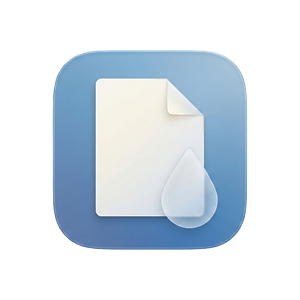
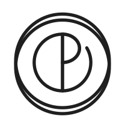

# ZenInk ✒️

<p>
  
  &nbsp;&nbsp;&nbsp;
  
</p>

**A viewer and editor for PDF drawings on Windows 11 — annotate, compare revisions, measure to scale and sign.**
Developed by **plano y escala**.


[](https://github.com/planoyescala/ZenInk/releases)

---

## 📋 Description

**ZenInk** is built for one job: reviewing large construction drawings without fighting the tool.

Architects, engineers and everyone else who works from drawings open sheets that a general-purpose PDF reader was never meant to handle: an A0 plan carrying tens of thousands of vector objects, opened to be moved around, marked up, measured, compared against last month's issue and sent back. Everything in ZenInk is shaped around that: the sheet is drawn in tiles so panning stays smooth, the marks are real PDF annotations that any other reader can see, and nothing is written over your file until what was written has been read back and checked.

It is part of the **ZenBIM** project, and it is **free software** under the GPLv3.

## ✨ Features (v0.0.1)

* **🗂️ A viewer made for big sheets:** tiled rendering over PDFium, continuous or page-by-page, one or two pages across, with the zoom gliding rather than jumping.
* **✏️ Annotations:** lines, arrows, polylines, rectangles, ellipses, polygons, revision clouds, text written on the sheet itself, notes, freehand pen and text highlighting — with colour, fill, opacity and line weight, and flattening when the review is closed.
* **📐 Measuring to scale:** calibrate a sheet by dragging over a dimension you know, then measure distance, perimeter, area and angle. The number is computed from the points and the scale, never typed in, and the scale travels with the sheet.
* **🔍 Revision comparison:** lay another issue of the same drawing over this one and step through what changed. The comparison is composed inside the tiles, so you can pan, zoom, capture and print it exactly as you see it.
* **📄 Sheet management:** reorder, rotate, duplicate, remove, insert sheets from another PDF, insert blanks, extract to a new file and split the document — with the PDF's own outline alongside.
* **✒️ Digital signature:** PAdES signatures with the certificate you already have in Windows, written as an incremental update so an earlier signature stays valid. Optional RFC 3161 timestamp and long-term validation data. There is also a plain stamp, which says plainly that it is *not* a signature.
* **📷 Region capture:** drag a box and the drawing lands on the clipboard at 200 dpi, ready to paste into an email.
* **🔎 Find, 🖨️ print and ⌨️ a command palette:** search across the document, print at a chosen scale — including poster mode across several sheets — and reach any tool by typing Ctrl+K.
* **🌗 Light and dark, 🌍 English and Spanish:** ZenInk follows the language and theme Windows is set to, and both can be overridden in Preferences.

---

## 💾 Download & Installation

1. **Download the installer** from the [Releases page](https://github.com/planoyescala/ZenInk/releases).
2. **Run it.** It installs into your user folder and **does not ask for administrator rights**, which matters on a company computer.
3. Open a PDF with it — ZenInk offers itself under *Open with*, and can be made the default from the Windows settings page it takes you to.

**Requirements:** Windows 10 version 1809 or later, 64-bit. Nothing else: .NET and the Windows App SDK travel inside the installer.

> **⚠️ The installer is not code-signed yet.** Windows SmartScreen will show a blue screen calling it an *unknown publisher*. Click **More info → Run anyway**. Signing is a decision for a later version, and the machinery for it is already in the build.

> **⚠️ This is a beta.** It works, and some of it does not yet. While the beta lasts, work on a copy of anything you cannot lose. ZenInk never writes over your drawing without reading back what it wrote, and always asks before flattening or signing — but a beta is a beta.

---

## 🔏 About the signature

ZenInk is **not a qualified trust service provider**. It signs with a certificate that is already installed on your computer — the Spanish FNMT one, for instance — and whether the resulting signature is valid, and what it is worth in front of anybody, depends on that certificate and on the authority behind it, not on ZenInk.

The **stamp** tool needs no certificate and is not a signature: it puts a box on the drawing saying who looked at it, it leaves no cryptographic evidence, and the program says so before placing it — and refuses to write *"digitally signed by"* over nothing.

---

## 🛠️ Building from source

```bash
dotnet build src/ZenInk.App/ZenInk.App.csproj -c Debug   # the application
dotnet run --project tests/ZenInk.Tests -c Release       # 831 checks over the engine
```

The engine — PDFium, tiles, text, the geometry of paper and of the marks — lives in `src/ZenInk.Core` and has no dependency on any user interface, so everything that can be checked without opening a window is checked in the suite. `src/ZenInk.App` is the WinUI 3 application and the viewer.

## 🤖 How it was built

Written by one person with **Claude** doing most of the typing, over a couple of months. That is worth saying out loud rather than hiding: the commit messages are long on purpose and explain *why* each decision was taken — including the ones that were wrong first — and the engine carries 831 checks, so that the parts nobody can judge by looking at a window are held down by something.

---

## ☕ Support

If **ZenInk** saves you an afternoon and you want to support free tools for the community, consider buying us a coffee!

<a href="https://www.buymeacoffee.com/planoyescala" target="_blank">
  
</a>

---

## ⚖️ License

**ZenInk** is free software: you can redistribute it and/or modify it under the terms of the **GNU General Public License v3.0 or later (GPLv3+)**. See [`LICENSE`](LICENSE).

It draws with [PDFium](https://pdfium.googlesource.com/pdfium/) (BSD-3-Clause) through [PDFiumCore](https://github.com/Dtronix/PDFiumCore) (Apache-2.0), on WinUI 3 and Win2D. Every third-party component that travels inside the program is listed in [`THIRD-PARTY-NOTICES.md`](THIRD-PARTY-NOTICES.md), with its full licence text under [`licenses/`](licenses).

We believe in open knowledge. If you use this code to build something great, you must share it alike.

*Copyright © 2026 **plano y escala**.*

---
<p align="center">
  <i>Built with ❤️ and C# for people who read drawings.</i>
</p>
